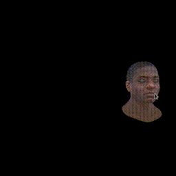

# Go parallel software renderer

## Goal

I set out to build a software renderer only using Go.
I've built single-threaded software renderers in C and C++ in the past.

After learing about Go's concurrency features I set out to build my 
fastest multi-threaded software renderer to date.

## Non-goals

I implemented simple diffuse rendering with simple lightning. I've built shadows and more complex 
lightning effects in my previous renderers. My main goal here was to design and build a parallel pipeline.

## Implementation details

Most of 3d rendering is easy to parallelize. The main challenge is preventing races when modifying the depth buffer.
### Occlusion
Triangles closer to the camera should occlude triangles further away from the camera. When rendering we update a buffer
with the distance to the camera of each pixel drawn to the screen. We check this buffer to verify that this pixel we're 
trying to draw is the closest one we've seen so far. If not, we skip it.

### Doing it wrong
Naively updating the depth buffer in multiple threads is bound to produce intermittent incorrect results.

Locking the whole buffer on every write will block every other thread that's trying to write to the screen. Making the
implementation even slower than a single threaded implementation because of huge lock contention.

### Doing it right

We divide the screen into tiles. Tile size can be any power of 2. We create a goroutine for each tile. Each goroutine listens on a buffered channel for
drawing commands.

We go through the list of triangles we check which tiles overlap with this triangle. We send draw commands to each tile.

Since all updates within a tile are sequential no global locking is required.

This is a known technique within the computer graphics community. 

Go's cooperative concurrency makes this approach go very fast. 

## Results

There's a single-threaded version of this renderer in the git history tagged "single_thread"
average frame render time was 140ms

The parallel version averages 40ms per frame! 

I keep the quality of the gif down to improve load speed, see the video for beter quality.

Youtube: https://youtu.be/gmkmSekyO1k
